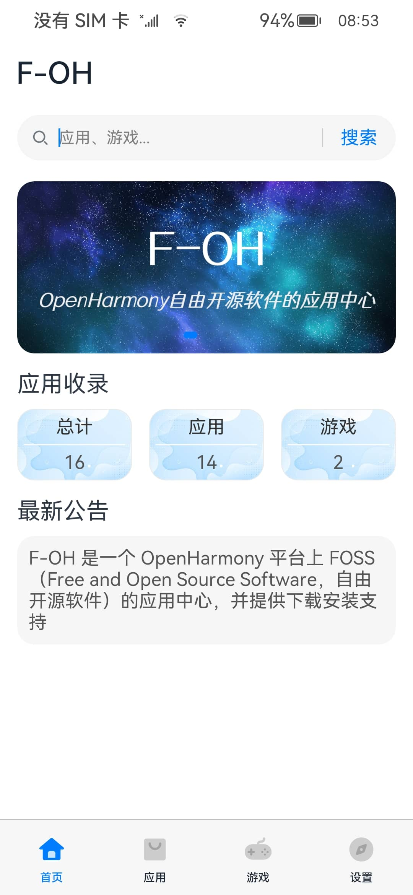
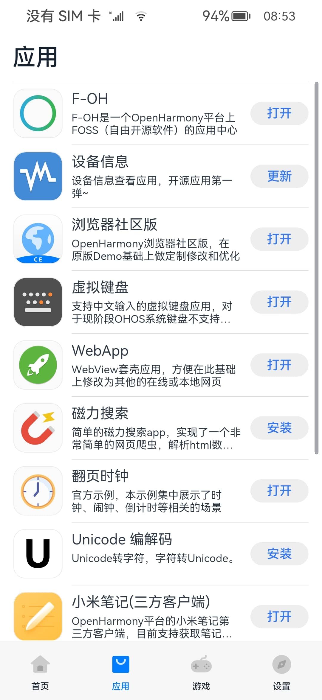
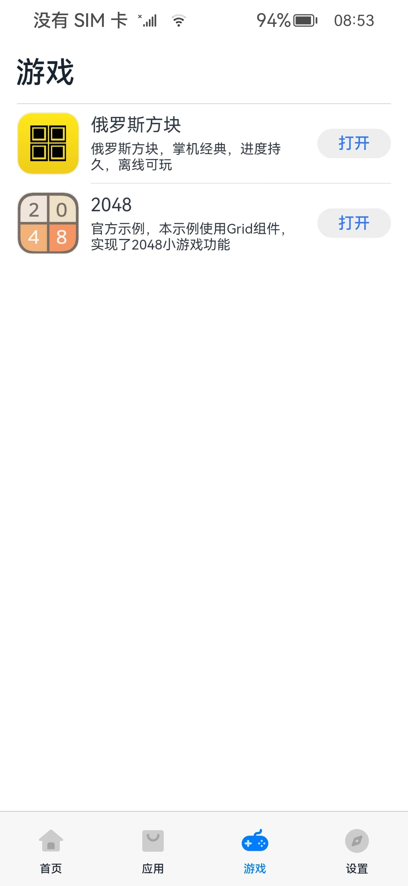
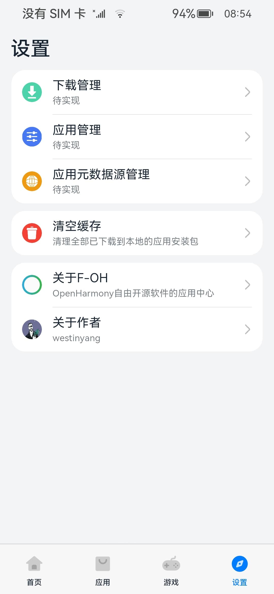
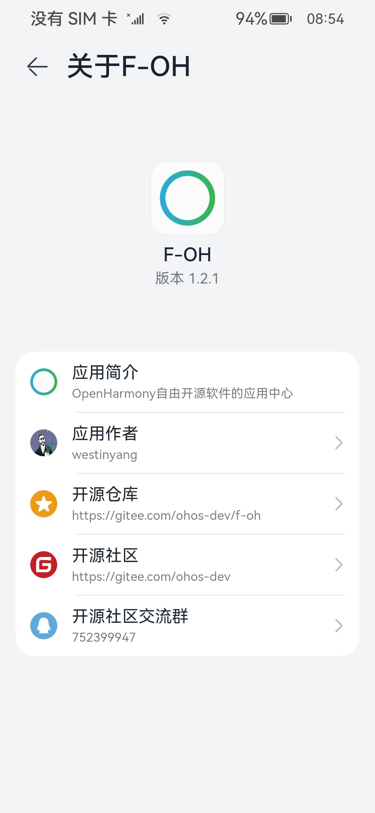

> 2023-12-29 [F-OH停服公告](ServerStopAnnouncement.md)

# F-OH

## 项目介绍

F-OH 是一个 OpenHarmony 平台上 FOSS（Free and Open Source Software，自由开源软件）的应用中心，并提供下载安装支持

F-OH 创建的初衷不论是命名还是愿景都受到了来自 [F-Droid](https://f-droid.org) 的启发，也许 OpenHarmony 背负了太多大家对国产化操作系统及生态的期待，那就让我们用实际行动由开源社区来共同维护和驱动 F-OH 去完成它的使命！

其实我给他想过一个中文的名字叫做：“自由开鸿”，很贴合F-OH的含义，但可能是我太执着太执念与最初的想法，暂时并不想改变它

开源仓库

- [Gitee](https://gitee.com/westinyang/f-oh)
- [Github](https://github.com/westinyang/f-oh)

### 系列项目

- [F-OH](https://gitee.com/westinyang/f-oh) `F-OH OpenHarmony 移动端`
- [F-OH Data](https://gitee.com/westinyang/f-oh-data) `F-OH 所有应用程序的元数据`
- [F-OH Server](F-OH-Server.md) `F-OH 服务器，提供接口服务、平台管理等（待开发）`
- [F-OH Website](F-OH-Web.md) `F-OH 网站，包含文档、博客、精选应用等（待开发）`

### 衍生项目

- [F-OH Web](https://gitee.com/ohos-dev/F-OH-Web) `使用 Bootstrap + Flask 实现的前后端一体的 F-OH Web版，并提供接口、应用上传和管理等功能，目前主要由 @myyauyau 来维护`
- [F-OH PWA](https://gitee.com/ohos-dev/F-OH-PWA) `F-OH的第三方PWA版本，并提供基于Tauri的客户端，目前主要由 @Jesse205 来维护`

## 下载安装

- https://gitee.com/westinyang/f-oh/releases

## ~~提交应用~~

> F-OH仅收录自由开源软件，“自由软件必定开源，开源软件未必自由，有些开源许可证对用户过于苛刻，它们就没有被列为自由软件”，引用自由GNU，FSF创始人——Richard Stallman编写的回答：[为什么开源错失了自由软件的重点？](https://www.gnu.org/philosophy/open-source-misses-the-point.zh-cn.html)

> 开发初期，为了最大程度减小后端开发和服务器的投入成本，暂时用自建的Git服务来协作管理应用的元数据

- [F-OH Data](https://gitee.com/westinyang/f-oh-data)
- ~~这里存放了 F-OH 所有应用程序的元数据，开发者在这里PR提交自己的应用~~
- ~~打开这个仓库链接，按照里面的指引去提交自己的应用（很简单的）~~

## 功能列表

客户端

- [x] 首页布局
- [x] 应用游戏（列表和状态同步）
- [x] 应用操作（下载、安装、打开）
- [x] 设置页面
- [x] 关于页面
- [x] 应用更新
- [x] 适配沉浸状态栏、导航栏
- [x] 清空缓存
- [x] 应用详情（简单实现，跳转开源仓库） 
- [x] 应用详情（完整实现）
- [ ] 丰富首页
- [ ] 应用搜索
- [ ] 下载管理
- [ ] 应用管理
- [ ] 应用元数据源管理

服务端

- [x] 简易的应用元数据源
- [ ] 完整的后端管理系统

## 开发环境

> [Full-SDK编译和替换指南](https://gitee.com/openharmony/docs/blob/OpenHarmony-3.2-Release/zh-cn/application-dev/quick-start/full-sdk-compile-guide.md)

- DevEco Studio 3.1 Release
- SDK API9 3.2.12.5 Release (Full-SDK)

## 兼容测试

- 因为目前我手上只有 一加6T OpenHarmony 3.2 Release
- 并没有任何标准系统的开发板，所以说横屏、分辨率等问题暂时无法调试优化

## 部署教程

- 拉取 [F-OH Data](https://gitee.com/westinyang/f-oh-data) 仓库到本地，进入此目录，启动一个静态资源服务器
- 修改客户端源码 `entry/src/main/ets/data/DataSource.ets` 第25行的 `ds_server` 指向你的静态资源服务器地址
- 重新编译即可

## 截图预览

## 视频演示

- [F-OH：OpenHarmony 自由开源软件的应用市场终于诞生啦~ 空前绝后~](https://www.bilibili.com/video/BV1dM411N7CG)
- [F-OH OpenHarmony应用市场 V1.1：更新应用、沉浸状态栏、新图标](https://www.bilibili.com/video/BV1ig4y1u7dD)
- [F-OH OpenHarmony应用市场 V1.2：内嵌浏览器、清空缓存、大量更新兼容优化](https://www.bilibili.com/video/BV1LP411S79y)
- [F-OH OpenHarmony应用市场 V1.3：新增应用详情，可查看开发者等信息](https://www.bilibili.com/video/BV1Th4y1Z7sm)

## 许可声明

- 本项目是以GPLv3许可开源，你可以根据自由软件基金会发布的 [GNU通用公共许可证](https://www.gnu.org/licenses/gpl.html) 的条款重新分配和/或对其进行修改
- 应用图标出处：https://www.flaticon.com/free-icon/ellipse_4674229
- 底部图标出处：https://gitee.com/openharmony/applications_app_samples
- 其他图标出处：https://www.flaticon.com/packs/basic-user-interface-147

## 赞助支持

- 我是一名独立开发者，F-OH和一些开源项目都是我的兴趣投入
- ~~F-OH的元数据服务器目前是自购自建，配置较低不太稳定~~
- ~~您的赞助支持将是 F-OH 运作的驱动力！（不限于开发板、服务器等）~~
- ~~赞助可私信联系或扫描下方二维码（赞助费用请备注“F-OH”或私信告诉我，方便统计到下方赞助列表中）~~

## 赞助列表

| 序号  | 赞助者                                          | 赞助类型 | 赞助内容              | 赞助时间       |
|-----|----------------------------------------------|------|-------------------|------------|
| 1   | A*y                                          | 费用   | ￥6.66             | 2023-06-21 |
| 2   | A*J                                          | 费用   | ￥10               | 2023-07-07 |
| 3   | *阳                                           | 费用   | ￥100              | 2023-08-08 |
| 4   | 原*y                                          | 费用   | ￥23.33            | 2023-08-15 |
| 5   | [鸿蒙坚果派](https://space.bilibili.com/480883651) | 设备   | 开发板 WuyiFH SEEK100 | 2023-08-19 |
| 6   | [深圳晶凌达](http://szjld.net)                    | 设备   | 开发板 JLD-A08       | 2023-08-25 |
| 7   | l*n                                          | 费用   | ￥8.88             | 2023-08-27 |
| 8   | *凯                                        | 费用   | ￥6.66             | 2023-09-01 |
| 9   | 乌拉大喵喵                                        | 费用   | ￥50                | 2023-09-04 |
| 10  | *具                                           | 费用   | ￥10                | 2023-09-16 |
| 11  | *拉                                           | 费用   | ￥10                | 2023-10-24 |
| 12  | *鸣                                           | 费用   | ￥6.66              | 2023-11-18 |
| 13  | *G                                           | 费用   | ￥9.99              | 2023-11-28 |
| 14  | k*m                                           | 费用   | ￥10              | 2023-12-17 |
